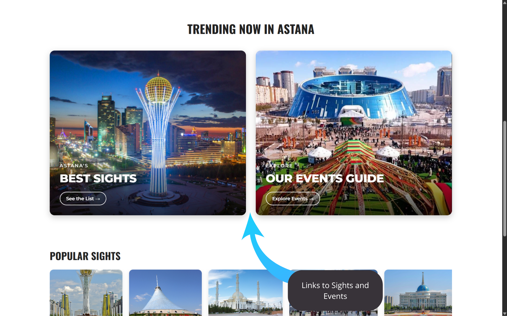
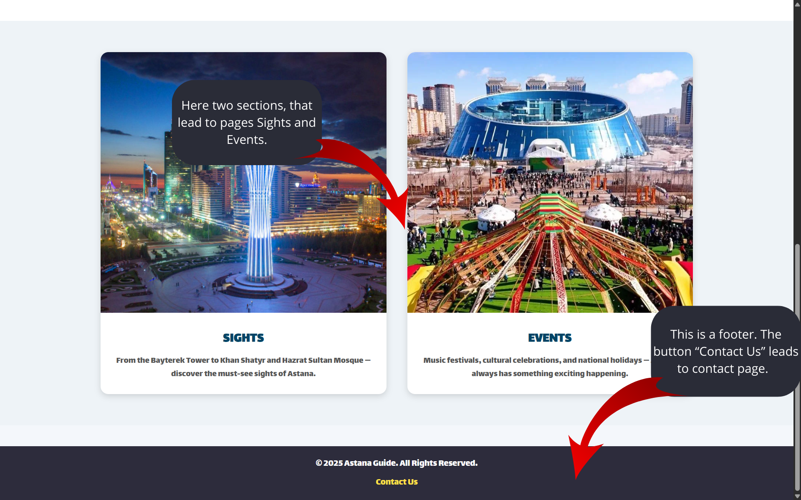
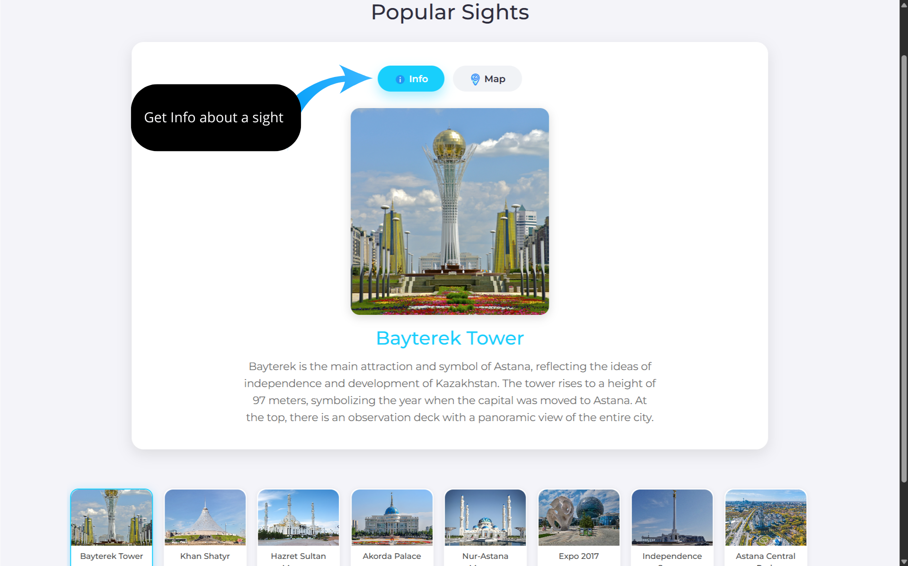
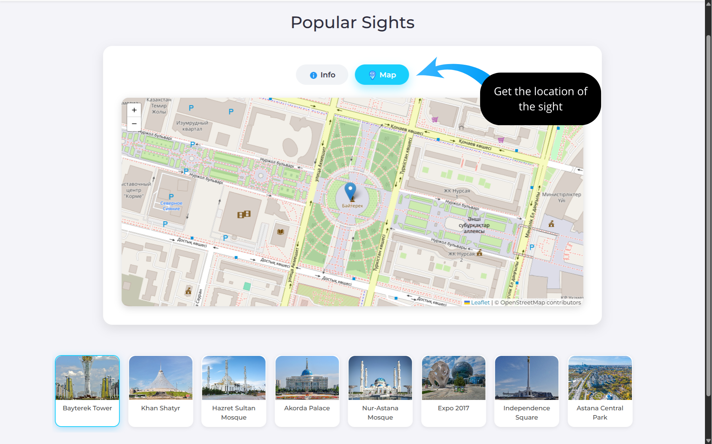
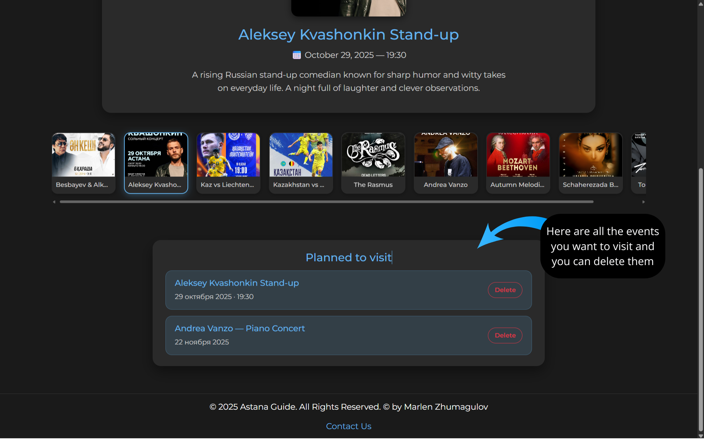
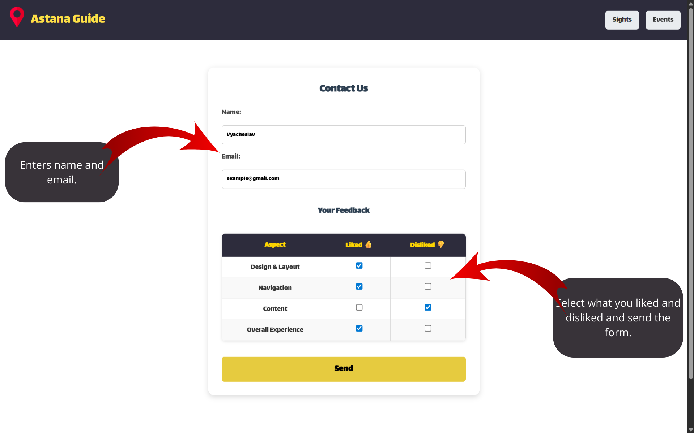

#  Astana Guide (HTML + CSS)
### 👥 Authors: *Vyacheslav Yakupov* and *Marlen Zhumagulov*

---

## 📖 Description
**Astana Guide** is an informational website designed to introduce visitors to the capital of Kazakhstan.  
The site highlights the city’s most iconic **sights** and **events**, combining cultural landmarks, modern architecture, and vibrant activities.  

It serves as a digital guide for travelers and residents who want to:  
- 🏙️ Explore Astana’s famous attractions such as **Bayterek Tower**, **Khan Shatyr**, and **Hazrat Sultan Mosque**.  
- 🎉 Stay updated on **festivals, concerts, and cultural events** happening in the city.  
- 🌐 Discover the unique mix of **tradition and modernity** that defines Kazakhstan’s capital.  

---

## 👨‍💻 Contribution of Authors  

- **Vyacheslav Yakupov** — created the **Home page** (`index.html`),**Contact page** (`contact.html`) and **About Us page** (`about.html`) along with their styles.  
- **Marlen Zhumagulov** — developed the **Sights page** (`sights.html`) and **Events page** (`events.html`) with their corresponding styles.  

---

## 🛠️ Components of the Website  

### 📂 HTML Pages  
- `index.html` — Home page  
- `contact.html` — Contact form  
- `sights.html` — Landmarks & attractions  
- `events.html` — Local events & activities  
- `about.html` - Information about website 

### 🎨 CSS Stylesheets  
- `index_style.css` — Styling for homepage  
- `contact_style.css` — Styling for contact page  
- `sights_style.css` — Styling for sights page  
- `events_style.css` — Styling for events page  
- `header_style.css` — Shared header styles  
- `footer_style.css` — Shared footer styles 
- `about_style.css` - Styling for about page 

---

# 🌐 Website Structure

## 🏠 Home Page

The **home page** serves as the welcoming entry point to the *Astana Guide* website.  
It introduces users to the project and provides quick navigation to the main sections.  

**Key elements:**  
- **Header with logo and navigation** → links to *Home*, *Sights*, *Events*, *About Us* 
- **Hero section** → large background image with a bold title and tagline.  
- **An arrow** that automatically points to the next component
- **Preview cards** → direct links to the *Sights* and *Events* pages with images and descriptions.  
- **List of sights and events** - as well as a list of attractions and events you can interact with.
- **Footer** → copyright + quick link to the *Contact* page.  

---

## 🏙️ Sights Page

The **Sights page** showcases Astana’s most popular landmarks and cultural attractions.  

**Key elements:**  
- 🧭 **Navigation header** → logo and menu for Home, Sights, Events, About Us.  
- 🗺️ **Sigt map section** → location of this landmark.
- 🗼 **Sight info section** → detailed blocks with image, title, and description for each landmark (*Bayterek Tower, Khan Shatyr, Hazret Sultan Mosque, Akorda Palace, Nur-Astana Mosque, Expo 2017, Independence Square, Central Park*).  
- 📜 **Scroll gallery** → horizontal thumbnail navigation that highlights the selected sight and updates the view.  
- 📩 **Footer** → copyright and contact.  

  

---

## 🎉 Events Page

The **Events page** highlights upcoming concerts, shows, and sports matches in Astana.  

**Key elements:**  
- 🧭 **Navigation header** → consistent with other pages (Home, Sights, Events, About Us).  
- 🎭 **Event cards** → each event includes an image, title, date, and short description (*concerts, football matches, stand-up shows*).  
- ✅ **To-do list** → two block "visited" and "wants to visit", if  you click on “wants to visit,” it will appear at the bottom of the scheduled events to visit.
- 📩 **Footer** → copyright and contact.  
  

---
## ℹ️ About Us Page

The **About Us page** introduces the Astana Guide project and its purpose.  

**Key elements:**  
- 🧭 **Navigation header** → consistent with other pages (Home, Sights, Events, About Us).  
- 🖼️ **About section** → image of Astana with a short text about the city’s culture, architecture, and events.  
- 📩 **Footer** → copyright and contact.  

---

## ✉️ Contact page 

The **Contact page** allows users to reach out and provide feedback.  

**Key elements:**  
- **Contact form** → fields for *Name* and *Email*.  
- **Feedback table** → users can indicate what they liked or disliked about the website (*Design, Navigation, Content, Overall Experience*).  
- **Submit button** → simple form submission option.  
- **Navigation & footer** → consistent with the other pages.    

---
 

# 🚀Project Update: Astana Guide
**(Version V2.0 - Assignment 2)**

We’ve given **Astana Guide** a full makeover to make it more modern, user-friendly, and visually appealing.  

✨ **What’s new:**  
- 🎨 **Revamped design** → updated color palette & new font for a fresh and modern look.  
- 🖼️ **Visual improvements** → more balanced layout with better color compatibility.  
- 🆕 **New “About Us” page** → introducing the project and its mission.  
- 🎡 **Expanded content** → added more attractions & events to explore.  
- 🖌️ **Custom styles** → improved CSS for cleaner and consistent design.  
- 📜 **Smooth scrolling** → horizontal scroll sections for attractions and events.  

💡 The result: a more **engaging, colorful, and intuitive guide** to Astana’s sights and events.  

 

# 🚀Project Update: Astana Guide

**(Version V3.1 - Assignment 4)** 

We’ve brought a brand-new update to **Astana Guide**, making it more interactive, informative, and personalized than ever before!  

✨ **What’s new:**  
- 🗺️ **New dual-section layout in Sights** → the *Sights* page is now divided into two parts:  
  - **Map section** — displays the exact **location** of each attraction on an interactive map.  
  - **Info section** — provides detailed **information** about the attraction (history, facts, and tips).  
- 🎯 **Interactive Events system** → added two new buttons:  
  - **“Visited”** — mark events you’ve already attended.  
  - **“Wants to visit”** — plan upcoming visits.  
- 📝 **To-Do List integration** → when you click **“Wants to visit”**, the event automatically appears below in a *“Planned visits”* list, helping you organize your travel plans.  
- 🖼️ **Local image storage** → all images are now stored **locally** for faster loading and better reliability (no external links required).  
- 💅 **Improved design consistency** → refined spacing, typography, and button styles for a smoother visual experience.  

# 🚀Project Update: Astana Guide

**(Version V4.0 - Assignment 5)**

We’re excited to announce a major update to **Astana Guide**, bringing new customization options, modern visuals, and smarter interactivity! 🌃  

✨ **What’s new:**  
- 🌑 **Dark Mode** → fully added **dark theme** support for a comfortable viewing experience at night or in low light.  
- 🏙️ **Upgraded Sights page** → now even more dynamic and flexible:  
  - 🖼️ You can **change images** of attractions directly.  
  - 🔗 Update **links** to maps or extra info about each sight.  
  - 👁️ Make any image **invisible** with one click.  
  - 📝 Option to **hide text** when clicking on an image — perfect for a clean, focused view.  
- 🎟️ **Events improvements** → added the ability to **remove “Planned to visit” blocks**, giving you full control over your event list.  
- 🖼️ **About Us page gallery** → a brand-new **photo gallery** showcasing the Astana Guide team, city moments, and project highlights.  

🧭 With these updates, **Astana Guide** becomes not just a travel helper — but your **personalized city experience platform**.

 

# 🚀 Deployment  
The project is deployed via **GitHub Pages** and can be accessed here:  
👉 [Astana Guide Live Demo](https://yakupovdev.github.io/AstanaGuide/) 📸 