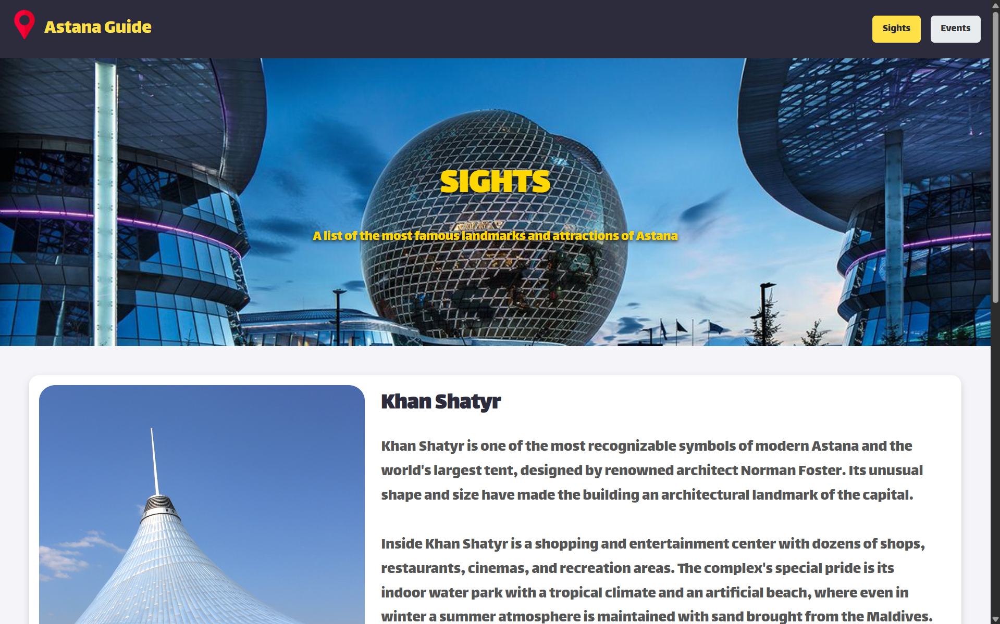
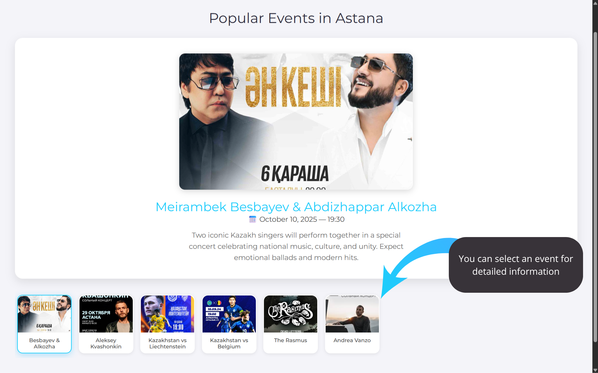

#  Astana Guide (HTML + CSS)
### 👥 Authors: *Vyacheslav Yakupov* and *Marlen Zhumagulov*

---

## 📖 Description
**Astana Guide** is an informational website designed to introduce visitors to the capital of Kazakhstan.  
The site highlights the city’s most iconic **sights** and **events**, combining cultural landmarks, modern architecture, and vibrant activities.  

It serves as a digital guide for travelers and residents who want to:  
- 🏙️ Explore Astana’s famous attractions such as **Bayterek Tower**, **Khan Shatyr**, and **Hazrat Sultan Mosque**.  
- 🎉 Stay updated on **festivals, concerts, and cultural events** happening in the city.  
- 🌐 Discover the unique mix of **tradition and modernity** that defines Kazakhstan’s capital.  

---

## 👨‍💻 Contribution of Authors  

- **Vyacheslav Yakupov** — created the **Home page** (`index.html`) and **Contact page** (`contact.html`) along with their styles.  
- **Marlen Zhumagulov** — developed the **Sights page** (`sights.html`) and **Events page** (`events.html`) with their corresponding styles.  

---

## 🛠️ Components of the Website  

### 📂 HTML Pages  
- `index.html` — Home page  
- `contact.html` — Contact form  
- `sights.html` — Landmarks & attractions  
- `events.html` — Local events & activities  

### 🎨 CSS Stylesheets  
- `index_style.css` — Styling for homepage  
- `contact_style.css` — Styling for contact page  
- `sights_style.css` — Styling for sights page  
- `events_style.css` — Styling for events page  
- `header_style.css` — Shared header styles  
- `footer_style.css` — Shared footer styles  

---

## 🌐 Website Structure

### 🏠 index.html — Home Page

The **home page** serves as the welcoming entry point to the *Astana Guide* website.  
It introduces users to the project and provides quick navigation to the main sections.  

**Key elements:**  
- **Header with logo and navigation** → links to *Sights* and *Events*.  
- **Hero section** → large background image with a bold title and tagline.  
- **About section** → short introduction about Astana, its architecture, and cultural life.  
- **Preview cards** → direct links to the *Sights* and *Events* pages with images and descriptions.  
- **Footer** → copyright + quick link to the *Contact* page.  

---

### 🏙️ sights.html — Sights Page

The **Sights page** highlights Astana’s most iconic landmarks and attractions.  

**Key elements:**  
- **Hero section** → background image with title and short introduction.  
- **Sight cards** → each attraction is presented as a card with an image, title, and detailed description.  
  - *Khan Shatyr* → modern entertainment center with a unique architectural design.  
  - *Baiterek Tower* → the main symbol of Astana with observation deck and symbolic design.  
- **Navigation & footer** → consistent with the other pages.    

---

### 🎶 events.html — Events Page

The **Events page** showcases upcoming cultural and entertainment events in Astana.  

**Key elements:**  
- **Hero section** → themed background with title and subtitle.  
- **Event cards** → visually engaging blocks containing images, dates, titles, and detailed event descriptions.  
  - *Backstreet Boys concert* → major international music event.  
  - *PGL Astana 2026* → Tier-1 Counter-Strike tournament hosted in the capital.  
  - *Vienna Strauss Philharmonie Orchestra* → classical music concert bringing European traditions to Astana.  
- **Navigation & footer** → consistent with the other pages.  

---

### ✉️ contact.html — Contact Page 

The **Contact page** allows users to reach out and provide feedback.  

**Key elements:**  
- **Contact form** → fields for *Name* and *Email*.  
- **Feedback table** → users can indicate what they liked or disliked about the website (*Design, Navigation, Content, Overall Experience*).  
- **Submit button** → simple form submission option.  
- **Navigation & footer** → consistent with the other pages.    

---

## 🚀 Deployment  
The project is deployed via **GitHub Pages** and can be accessed here:  
👉 [Astana Guide Live Demo](https://yakupovdev.github.io/AstanaGuide/) 📸 
