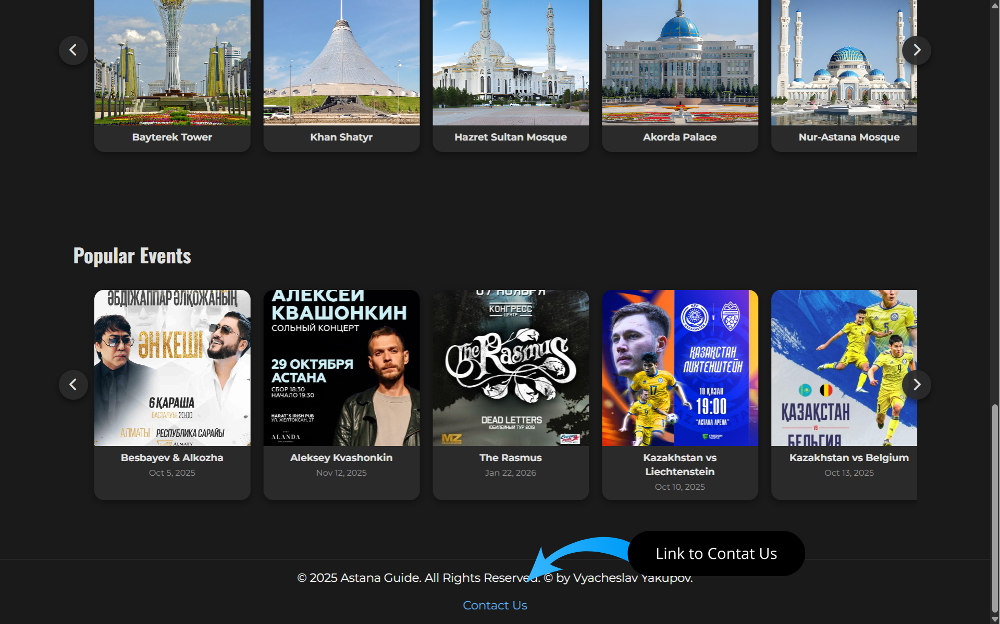

#  Astana Guide (HTML + CSS)
### 👥 Authors: *Vyacheslav Yakupov* and *Marlen Zhumagulov*

---

## 📖 Description
**Astana Guide** is an informational website designed to introduce visitors to the capital of Kazakhstan.  
The site highlights the city’s most iconic **sights** and **events**, combining cultural landmarks, modern architecture, and vibrant activities.  

It serves as a digital guide for travelers and residents who want to:  
- 🏙️ Explore Astana’s famous attractions such as **Bayterek Tower**, **Khan Shatyr**, and **Hazrat Sultan Mosque**.  
- 🎉 Stay updated on **festivals, concerts, and cultural events** happening in the city.  
- 🌐 Discover the unique mix of **tradition and modernity** that defines Kazakhstan’s capital.  

---

## 🛠️ Components of the Website  

### 📂 HTML Pages  
- `index.html` — Home page  
- `contact.html` — Contact form  
- `sights.html` — Landmarks & attractions  
- `events.html` — Local events & activities  

### 🎨 CSS Stylesheets  
- `index_style.css` — Styling for homepage  
- `contact_style.css` — Styling for contact page  
- `sights_style.css` — Styling for sights page  
- `events_style.css` — Styling for events page  
- `header_style.css` — Shared header styles  
- `footer_style.css` — Shared footer styles  

---

## 📸 Screenshots  

### 🔝 Homepage Header  

### 🔻 Homepage Footer  

---

## 🚀 Deployment  
The project is deployed via **GitHub Pages** and can be accessed here:  
👉 [Astana Guide Live Demo](https://yakupovdev.github.io/AstanaGuide/)  
